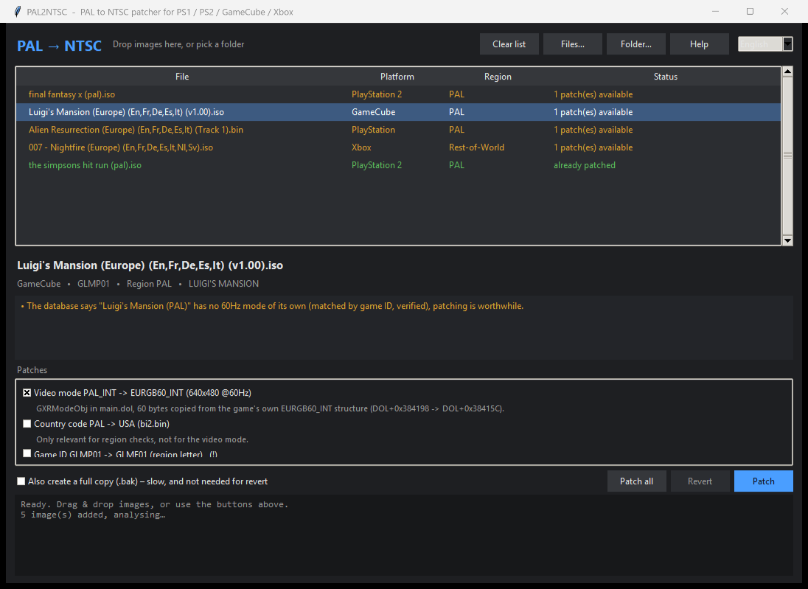

# PAL2NTSC

*[Deutsche Fassung: README.de.md](README.de.md)*

Converts PAL disc images of **PlayStation, PlayStation 2, GameCube and Xbox**
games to NTSC, so they run at 60 Hz instead of 50 Hz.

The point is keeping your language. PAL releases usually carry the localised
audio and text that the US release drops, but they run 17 % slower with black
bars. This tool changes the video standard inside the PAL release itself, so
the localisation stays and the picture runs at 60 Hz.

Every change is written in place, byte for byte the same size, and can be
undone at any time.



```
python pal2ntsc_cli.py patch "Final Fantasy X (PAL).iso"
```

or drop the image onto the window:

```
PAL2NTSC.bat
```

## Features

* **Four platforms**: PlayStation, PlayStation 2, GameCube, Xbox
* **Fully reversible**: a small journal file next to the image records the
  original bytes, so undoing takes seconds instead of restoring a backup
* **Nothing is guessed**: every patch is located by structure in the
  executable, verified byte by byte before writing, and refused if the image
  does not match
* **Knows when to do nothing**: a database of 1648 titles says whether a game
  can already switch to 60 Hz by itself
* **German and English**, interface, messages and built in help
* GUI with drag and drop, plus a command line for batch runs over whole folders

## Requirements

Python 3.8 or newer. For drag and drop, optionally:

```
pip install tkinterdnd2
```

Everything else works without it. No other dependencies.

## Usage

### Graphical

Start `PAL2NTSC.bat` (or `pythonw PAL2NTSC.pyw`), drop images onto the window,
tick the patches, press *Patch*. The language selector sits in the top right.

### Command line

```
python pal2ntsc_cli.py scan   <file|folder> [...]   analyse only
python pal2ntsc_cli.py patch  <file> [--all] [--backup] [-y]
python pal2ntsc_cli.py revert <file> [--only NAME ...] [--list]
python pal2ntsc_cli.py help
```

Add `--lang de` or `--lang en` to switch the output language. `scan` accepts
whole folders. Without `--all`, only the recommended patches are applied;
optional ones such as region flags stay out.

## How it works

Every change is written **in place and at exactly the same byte count**. That
is not a matter of taste: as soon as the size or table of contents of a PS2
image changes, it is no longer recognised as a PS2 disc.

This has a pleasant consequence for undoing. Because only a few bytes are
replaced, a small journal file next to the image is enough:

```
Final Fantasy X (PAL).iso              4,600,725,504 bytes
Final Fantasy X (PAL).iso.pal2ntsc.json          631 bytes
```

The journal holds the offset plus the original and the patched bytes. *Revert*
writes the original bytes back. Before every write the tool verifies that the
expected bytes are still at the target address, otherwise it aborts rather than
destroying anything. A full copy (`.bak`) can be ticked as well, but it is not
needed for reverting.

### PlayStation 2

Sony's `libgraph` initialises graphics through
`sceGsResetGraph(mode, interlace, omode, ffmd)`. The third parameter selects the
video standard: 2 is NTSC, 3 is PAL. In the function prologue it is sign
extended from the argument via `sra rd, a2, 16`; the patch replaces that with
`addiu rd, zero, 2`, pinning NTSC.

The function is located through its GS reset, writing `0x200` to `0x12001000`
(GS_CSR), rather than through symbols. That works without debug information.

> Checked against a collection of 40 PAL titles: **37 detected**. The three
> exceptions are 007 titles with very small loader executables that pull in the
> actual game later.

### GameCube

The SDK stores a 60 byte structure (`GXRModeObj`) per video standard in
`main.dol`: NTSC, MPAL, PAL, EURGB60. A PAL game reads the PAL structure at
runtime, so the patch overwrites its contents with the EURGB60 structure that
is already present in the same file.

The advantage: the target values are not invented, they come from the game
itself. Game logic is left untouched.

### PlayStation

`libgpu` keeps the video mode in a global variable written by `SetVideoMode`.
The patch replaces `sw $a0` there with `sw $zero`, so the variable always
receives 0, meaning NTSC, regardless of what the game passes in. The method
comes from the 1999 tool PALNTSC by KEuBo, whose README spells the edit out.

The code pattern alone is not enough, because another `libgpu` function is
built identically. The two are told apart by the access profile of their
variable: the video mode variable is read only by its own getter and written in
exactly one place.

| Profile | Meaning | Sites |
|---|---|---:|
| 2 readers, 1 writer | genuine `SetVideoMode` | 74 |
| 1 reader, 3 to 4 writers | different function, do not patch | 40 |

Without that check, 30 titles would get extra, wrong sites patched along.

> Checked against the PAL titles in the collection: **69 of 76 patchable
> (90 %)**, exactly one site per game.

Since PS1 images are almost always raw sectors, EDC/ECC is recomputed per
ECMA-130 after every change, otherwise error correction would trip.

> The EDC/ECC implementation was verified against real pressings: 48 of 48
> sectors from four games were reproduced bit for bit.

### Xbox

Said plainly: the Xbox video standard is **not in the image**. The console
supplies it from the EEPROM (dashboard setting), and games query it via
`XGetVideoStandard()`. An image patch cannot replace that. The right lever is
the console or emulator setting; in xemu, set the video standard to NTSC-M.

What the module does offer: widening the region flag in the XBE certificate, so
a title does not fail a region check. Both Redump images and `extract-xiso`
rebuilds are recognised. Files ending in `.old` or `.bak` are never patched,
they count as backups.

## The title database

`pal2ntsc/data/pal60_db.json` says, before patching, whether a game can already
switch between 50 and 60 Hz on its own. If it can, the change is usually
unnecessary.

| Platform | Titles | of those 60 Hz capable |
|---|---:|---:|
| PlayStation 2 | 978 | 276 |
| GameCube | 248 | 76 |
| Xbox | 208 | 112 |
| PlayStation | 214 | 75 |

Matching runs via game ID, or, where the sources only carry titles, via a
normalised title comparison. An approximate match is flagged as such.

**All of this is community knowledge, not independently verified.** Every entry
carries its provenance. Independently of the lists, the tool searches each
image itself for 50/60 Hz strings, which catches titles missing from every
list. Sources are credited at the bottom of this file.

## What a patch does, and what it does not

What changes is the video standard. Whether smoother 60 fps follow depends on
the game:

* Many titles tie their logic to the frame refresh, so they genuinely run
  faster and smoother.
* Others keep PAL timing, so only the picture is output at 60 Hz.
* Some PAL releases still render more scanlines than NTSC displays. The picture
  can then look cropped at the bottom. See the next section.

If a game misbehaves, *Revert* restores the original state.

## Game-specific patches

Occasionally a game ends up cropped at the bottom after the switch, with half
the HUD gone. The cause is not the screen position but the **render height**:
the game still draws for PAL (512 lines) while NTSC only shows 448.

Example, *The Simpsons: Hit & Run* (PAL), at `0x003734C0`:

```
addiu $v1, $zero, 0x1c0   ; 448  (NTSC)
addiu $a0, $zero, 0x200   ; 512  (PAL)
lw    $v0, 4($a1)         ; PAL flag
movn  $v1, $a0, $v0       ; switches to 512
sw    $v1, 0x28($s0)      ; stored as render height
```

A `nop` over the `movn` leaves the NTSC value in place, which fixes it.

This does not generalise, because every game makes that choice differently.
Such cases live in `pal2ntsc/data/game_patches.json`, keyed by game ID and
extensible one entry at a time. Offsets are relative to the executable, not to
the image, and every site is byte verified. An entry only becomes
`"verified": true` once its effect has been checked in the game, not merely
because the code looks plausible.

To find new cases:

```
python tools/find_height_select.py "<image.iso>"
```

The tool prints a ready made database entry. When it finds nothing, it reports
whether the height constants appear in the code at all, which distinguishes
"game is not affected" from "different construction, check by hand".

## Layout

```
PAL2NTSC.pyw            interface (drag and drop, DE/EN)
pal2ntsc_cli.py         command line
pal2ntsc/
  __init__.py           analyse() / patch() / revert(), database lookup
  i18n.py               bilingual message catalogue
  help_text.py          in-app help
  journal.py            patch journal, verification and revert
  gamepatch.py          game-specific patches from the database
  platforms/
    common.py           Patch and GameInfo types
    ps2.py  gamecube.py  ps1.py  ps1_sig.py  xbox.py
    cdrom_ecc.py        EDC/ECC per ECMA-130 for PS1 raw sectors
  data/
    pal60_db.json       title database
    game_patches.json   game-specific patches
    ps1_signatures.json additional PS1 signatures
tools/
  import_db.py          rebuilds the title database from saved sources
  find_height_select.py finds render height selections
```

## Legal

This tool modifies disc images you already own. It contains no game code, no
keys and no copyrighted game data. Creating a backup of media you own is
permitted in many jurisdictions but not in all of them, so please check your
local law. Obtaining or distributing games you do not own is not.

## Credits

* **PALNTSC** (KEuBo, TEAM STufF, 1999) documented the PS1 `SetVideoMode` edit
  in its README, which is the basis of the PlayStation method here. The code in
  this repository is an independent implementation.
* **PALadin** by [ticky](https://github.com/ticky/paladin) pointed at
  `PutDispEnv` and the Y position handling.
* The title database was compiled from community lists: the ConsoleMods Wiki
  (GameCube display modes, PlayStation PAL optimised titles), a list of 60 Hz
  support in PAL PlayStation 2 games, and a Blogspot compilation of Xbox titles
  with PAL60 support.

## Author and licence

Written by **frankyfife**.

Released under the [MIT License](LICENSE).
